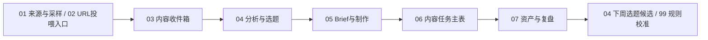

# AI账号信息雷达系统地图

这套系统不是一堆表，而是一条从内容输入到选题、制作、任务、复盘的链路。



## 每张表一句话

- `00 主控台`：唯一入口，告诉你今天该看什么、推进什么、哪里有异常。
- `01 来源与采样`：来源池和采样权重，默认看 `当前主对标池`；另有 `历史参考池`、`系统/官方源`、`手动入口` 三个视图。
- `02 URL投喂入口`：临时粘贴公众号文章、抖音单条视频、RSS/Atom 或普通网页链接，交给 `url_content_resolver.py` 解析。
- `03 内容收件箱`：后台内容账本，保存本轮参与拆解的 URL 投喂、AIHOT 和其他 ContentItem；可看 `今日采集` 视图排查来源、是否全文解析、正文长度、payload 路径、解析说明和运行批次。
- `04 分析与选题`：今日候选池和选题决策区；默认只展示业务决策字段，用 `今日建议级别 / 编辑判断分 / AI味风险 / 内容可信度 / 推荐理由 / 不建议做的原因` 帮你判断真正值得推进的 1-3 条。
- `05 Brief与制作`：把选题拆成平台内容和 Brief，补 Hook、案例、结构和 CTA。
- `06 内容任务主表`：今天真正执行的写稿、拍摄、剪辑、封面、发布、直播和复盘任务。
- `07 资产与复盘`：发布后看数据、复刻价值、改角度再发和资产化机会。
- `99 规则与字典`：系统说明书，解释字段、状态、评分、AI 边界和表逻辑。

## 每天怎么用

打开 `00 主控台 / 今日工作台` → 看 `今日候选池` → 在 `04` 选 1 条改为 `进入Brief` 或 `本周做` → 运行 `content_ops_pipeline.py --write-feishu` 承接到 `05/06` → 进 `05` 补 Brief → 看 `06 今日待办` 执行 → 发布后进 `07` 复盘。

如果只是想理解表之间怎么连，再切到 `00 主控台 / 系统导航`。不要每天看系统导航。

## 不要每天打开的表

`01 来源与采样`、`02 URL投喂入口`、`03 内容收件箱`、`99 规则与字典` 都不是日常任务入口。只有补链接、排查 URL 解析、查看原始内容/全文、检查 AIHOT 是否入账或调整规则时再打开。当前 URL 投喂只正式支持公众号文章、抖音单条视频、RSS/Atom 和普通网页。公众号按全文解析并记录正文长度；抖音 P0 只做浅层解析，口播转写/画面 OCR 属于需要 API key 的 P1 增强。

规则复盘时可以复用已解析 URL，不需要每次重新找新链接：

```bash
python3 scripts/daily_pipeline.py --resolve-url-intake --include-resolved-url-intake
```

这个参数只用于测试混合候选池，会让已解析的公众号/抖音/RSS/网页 URL 重新参与本轮候选；默认日常流程仍只处理待解析 URL。

当前默认自动源是 AIHOT、官方 RSS/Atom、官方网页/普通网页/Jina Reader、URL 投喂，以及主对标抖音账号主页标题/文案采样。抖音主页采样失败时只记录失败原因并跳过，不阻塞其他来源。公众号历史列表不直接进入默认流程。完整自动拉取路线见 `docs/source_autofetch_plan.md`。

卡兹克公众号 Wechat2RSS 公共 feed 已降级为发现源说明，不再进入 `03 内容收件箱` 或 `04 今日候选池`。公众号候选以全文为准：优先用本地 `wewe-rss` 全文 provider，或者在 `02 URL投喂入口` 粘贴单篇文章 URL。

公众号全文 provider 已有显式 P1 路线：本地 `wewe-rss` 可通过 `python3 scripts/daily_pipeline.py --fetch-wechat-fulltext-provider --wechat-fulltext-provider wewe-rss --wechat-feed-limit 5` 拉取卡兹克全文；默认工作流不依赖本地服务。`we-mp-rss` 因需要公众号平台扫码授权，已从当前主路线降级。当前结论见 `docs/spikes/wechat_fulltext_provider_eval.md`。

抖音主页标题/文案采样现在是日常默认输入，但只用于先判断“是否值得转写”和是否有选题价值，不直接做深拆。字幕/ASR 仍然只适合显式命令和 API key。当前结论见 `docs/spikes/douyin_open_source_tool_eval.md`。

当前可用的抖音主页轻量探针是 `scripts/douyin_source_watch_probe.py`，但日常默认使用的是登录态更稳定的 `scripts/douyin_cdp_source_watch_probe.mjs`。它输出本地 ContentItem 后进入 `daily_pipeline.py` 的候选输入；正式 `--write-feishu` 时会和其他来源一样写入 `03 内容收件箱` 并参与 `04 今日候选池`。

`scripts/douyin_cdp_source_watch_probe.mjs` 通过 Chrome DevTools Protocol 低频打开主对标抖音主页，只在发现可信账号作品 ID 时才复用单条视频 resolver；如果页面返回服务异常或混入热门推荐，脚本会标记为 `needs_login_or_verification` / `partial_untrusted`，不输出 ContentItem。为避免打扰日常工作，`daily_pipeline.py` 会先用 `scripts/start_douyin_cdp_chrome.py --port 9333` 以默认 `hidden` 模式后台启动/复用专用 Chrome；采样时脚本使用后台 target 并尽量最小化专用 Chrome。若某个账号需要登录/验证码，daily pipeline 会前台打开专用 Chrome 到该账号主页，等待用户处理后只重试这些账号；仍失败才记录为待处理并继续其他来源。

抖音转写也不是默认流程。先运行 `scripts/douyin_transcript_candidates.py`，从主页采样结果里筛出值得转写的 1-2 条；只有显式执行 `scripts/douyin_video_transcribe.py --raw-payload <raw.json> --model paraformer-v2 --confirm-free-quota --yes` 才会调用百炼 ASR。已经转写过的视频可用 `--transcript-file` 重新包装成 ContentItem，再通过 `daily_pipeline.py --include-douyin-transcripts` 进入候选池，不重复消耗额度。

对标视频进入候选池后，只借鉴话题、结构、专业证明和商业入口。用户可见标题要转成自己的 AI导演/业务流程语言，不出现其他博主名字，也不写“这条视频/这条内容”。

选题编辑判断已抽成全局 Skill：`ai-account-editorial-director`，路径是 `/Users/congcong/.codex/skills/ai-account-editorial-director`。代码负责采集、标准化、去重和初筛；`scripts/editorial_skill_runner.py` 默认直接调用本机 Codex CLI，让这个全局 Skill 重新做主编判断，把候选转成更像用户自己的“场景拆解、思考点、重点体现和可调用案例”，再写入 `04 分析与选题`。详细说明见 `docs/ai_account_editorial_director_skill.md`。

当前主链路是：

```text
AIHOT / 公众号全文 / 抖音主页标题文案 / URL投喂
→ ContentItem
→ 03 内容收件箱
→ content_sampler.py 初筛和去重
→ editorial_skill_runner.py 调用 ai-account-editorial-director 做主编筛选
→ 04 分析与选题 / 今日候选池
```

## 原则

后台可以复杂，前台只保留今天要做什么。
