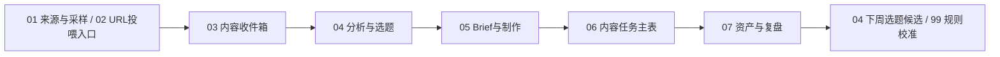

# AI账号信息雷达系统地图

这套系统不是一堆表，而是一条从内容输入到选题、制作、任务、复盘的链路。



## 每张表一句话

- `00 主控台`：唯一入口，告诉你今天该看什么、推进什么、哪里有异常。
- `01 来源与采样`：来源池和采样权重，默认看 `当前主对标池`；另有 `历史参考池`、`系统/官方源`、`手动入口` 三个视图。
- `02 URL投喂入口`：临时粘贴公众号文章、抖音单条视频、RSS/Atom 或普通网页链接，交给 `url_content_resolver.py` 解析。
- `03 内容收件箱`：后台内容账本，保存本轮参与拆解的 URL 投喂、AIHOT 和其他 ContentItem；可看 `今日采集` 视图排查来源、是否全文解析、正文长度、payload 路径、解析说明和运行批次。
- `04 分析与选题`：今日 Top10 和选题决策区；`可发布标题`用于前台阅读，`内部切入角度`解释为什么这么蹭热点，`编辑判断分 / 标题质量分 / AI味风险 / 今日建议级别 / 主编判断 / 不建议做的原因`帮助区分真正值得推进的 1-3 条，最后决定做、不做、暂存还是进入 Brief。
- `05 Brief与制作`：把选题拆成平台内容和 Brief，补 Hook、案例、结构和 CTA。
- `06 内容任务主表`：今天真正执行的写稿、拍摄、剪辑、封面、发布、直播和复盘任务。
- `07 资产与复盘`：发布后看数据、复刻价值、改角度再发和资产化机会。
- `99 规则与字典`：系统说明书，解释字段、状态、评分、AI 边界和表逻辑。

## 每天怎么用

打开 `00 主控台 / 今日工作台` → 看 `今日10选题` → 在 `04` 选 1 条改为 `进入Brief` 或 `本周做` → 运行 `content_ops_pipeline.py --write-feishu` 承接到 `05/06` → 进 `05` 补 Brief → 看 `06 今日待办` 执行 → 发布后进 `07` 复盘。

如果只是想理解表之间怎么连，再切到 `00 主控台 / 系统导航`。不要每天看系统导航。

## 不要每天打开的表

`01 来源与采样`、`02 URL投喂入口`、`03 内容收件箱`、`99 规则与字典` 都不是日常任务入口。只有补链接、排查 URL 解析、查看原始内容/全文、检查 AIHOT 是否入账或调整规则时再打开。当前 URL 投喂只正式支持公众号文章、抖音单条视频、RSS/Atom 和普通网页。公众号按全文解析并记录正文长度；抖音 P0 只做浅层解析，口播转写/画面 OCR 属于需要 API key 的 P1 增强。

规则复盘时可以复用已解析 URL，不需要每次重新找新链接：

```bash
python3 scripts/daily_pipeline.py --resolve-url-intake --include-resolved-url-intake
```

这个参数只用于测试混合候选池，会让已解析的公众号/抖音/RSS/网页 URL 重新参与本轮候选；默认日常流程仍只处理待解析 URL。

当前默认自动源是 AIHOT、官方 RSS/Atom、官方网页/普通网页/Jina Reader 和 URL 投喂；主对标账号自动抓取仍处于 P1 阶段。抖音主页、公众号历史列表不直接进入默认流程。完整自动拉取路线见 `docs/source_autofetch_plan.md`。

卡兹克公众号 feed 候选验证见 `docs/spikes/wechat_feed_candidate_verification.md`。当前已发现一个 Wechat2RSS XML feed，并做成 P1 显式接入：只有运行 `python3 scripts/daily_pipeline.py --fetch-wechat-feed --wechat-feed-limit 5` 时才拉取。默认流程不写入 `03 内容收件箱`，也不参与 `04 今日Top10`；如果 feed 失效，继续用 `02 URL投喂入口` 粘贴单篇文章 URL。

公众号全文 provider 仍是 POC。`we-mp-rss` / `wewe-rss` 需要本机 Docker 服务和专用微信小号扫码授权，当前结论见 `docs/spikes/wechat_fulltext_provider_eval.md`；默认工作流不依赖这些服务。

## 原则

后台可以复杂，前台只保留今天要做什么。
