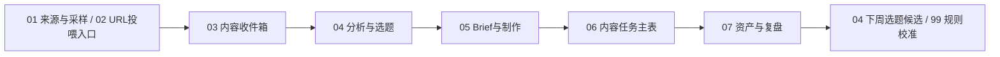

# AI账号信息雷达系统地图

这套系统不是一堆表，而是一条从内容输入到选题、制作、任务、复盘的链路。

## 每张表一句话

- `00 主控台`：唯一入口，告诉你今天该看什么、推进什么、哪里有异常。
- `01 来源与采样`：来源配置和采样规则，主要给系统和低频维护用。
- `02 URL投喂入口`：临时粘贴公众号、AIHOT、抖音、小红书、视频号链接或 OCR 文本。
- `03 内容收件箱`：后台内容池，保存采集到的原始内容和解析状态。
- `04 分析与选题`：今日 Top10 和选题决策区，决定做、不做、暂存还是进入 Brief。
- `05 Brief与制作`：把选题拆成平台内容和 Brief，补 Hook、案例、结构和 CTA。
- `06 内容任务主表`：今天真正执行的写稿、拍摄、剪辑、封面、发布、直播和复盘任务。
- `07 资产与复盘`：发布后看数据、复刻价值、改角度再发和资产化机会。
- `99 规则与字典`：系统说明书，解释字段、状态、评分、AI 边界和表逻辑。

## 每天怎么用

打开 `00 主控台 / 今日工作台` → 看 `今日10选题` 和 `今日必须完成` → 选 1 条 → 进 `05` 补 Brief → 看 `06 今日待办` 执行 → 发布后进 `07` 复盘。

如果只是想理解表之间怎么连，再切到 `00 主控台 / 系统导航`。不要每天看系统导航。

## 不要每天打开的表

`01 来源与采样`、`02 URL投喂入口`、`03 内容收件箱`、`99 规则与字典` 都不是日常任务入口。只有补链接、排查采集、查看原始内容或调整规则时再打开。

## 原则

后台可以复杂，前台只保留今天要做什么。
