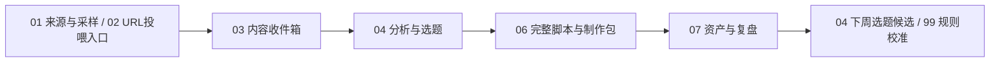

# AI账号信息雷达系统地图

这套系统不是一堆表，而是一条从内容输入到选题、制作、任务、复盘的链路。



## 每张表一句话

- `00 主控台`：唯一入口，告诉你今天该看什么、推进什么、哪里有异常。
- `01 来源与采样`：来源池，默认看 `当前主对标池`；这里只判断来源是否跟进、怎么抓取、优先级是什么，不预设账号栏目。另有 `历史参考池`、`系统/官方源`、`手动入口` 三个兼容/后台视图。
- `02 URL投喂入口`：临时粘贴公众号文章、抖音单条视频、RSS/Atom 或普通网页链接，交给 `url_content_resolver.py` 解析。
- `03 内容收件箱`：后台内容账本，保存本轮参与拆解的 URL 投喂、AIHOT 和其他 ContentItem；可看 `今日采集` 视图排查来源、是否全文解析、正文长度、payload 路径、解析说明和运行批次。
- `04 分析与选题`：飞书原生选题挑选台；默认看 `今日挑选卡片`，快速扫 `选题标题` 和 `卡片速读`，判断真正值得推进的 1-3 条，并直接改 `状态` 和 `选择原因标签`。`今日决策看板` 用来按状态推进，`待学习样本` 用来沉淀你的选择偏好。标题包装、分数和后台追踪不再放在 04 前台。
- `06 完整脚本与制作包`：保存已生成完整口播稿与制作执行包的记录，包括状态、核心观点、开头钩子、飞书文档/文件夹入口、文档同步状态、本地文档、素材提醒、发布前核验和 QA；完整正文优先看飞书文档，用户可见文件夹入口是飞书云盘里的 `AI账号信息雷达 / 06完整脚本与制作包`，本地平铺 Markdown 是备份。
- `07 资产与复盘`：发布后看数据、复刻价值、改角度再发和资产化机会。
- `99 规则与字典`：系统说明书，解释字段、状态、评分、AI 边界和表逻辑。

## 每天怎么用

打开 `00 主控台 / 今日工作台` → 看交互式选题速选卡或 `04 / 今日挑选卡片` → 勾选值得推进的候选并补制作方向 → 运行 `learn_from_topic_selection.py` 生成待确认选择学习摘要 → 本机轻量 watcher 按需调用 Codex 写入 `06 完整脚本与制作包` → 优先打开 `06 / 飞书文档` 看完整脚本、素材待办、剪辑交接和 QA；如果 `文档同步状态` 报警，再打开本地文档路径 → 发布后进 `07` 复盘。

如果只是想理解表之间怎么连，再切到 `00 主控台 / 系统导航`。不要每天看系统导航。

## 不要每天打开的表

`01 来源与采样`、`02 URL投喂入口`、`03 内容收件箱`、`99 规则与字典` 都不是日常任务入口。只有补链接、排查 URL 解析、查看原始内容/全文、检查 AIHOT 是否入账或调整规则时再打开。当前 URL 投喂只正式支持公众号文章、抖音单条视频、RSS/Atom 和普通网页。公众号按全文解析并记录正文长度；抖音 P0 只做浅层解析，口播转写/画面 OCR 属于需要 API key 的 P1 增强。

规则复盘时可以复用已解析 URL，不需要每次重新找新链接：

```bash
python3 scripts/daily_pipeline.py --resolve-url-intake --include-resolved-url-intake
```

这个参数只用于测试混合候选池，会让已解析的公众号/抖音/RSS/网页 URL 重新参与本轮候选；默认日常流程仍只处理待解析 URL。

当前默认自动源是 AIHOT、官方 RSS/Atom、官方网页/普通网页/Jina Reader、URL 投喂，以及主/辅对标抖音账号主页标题/文案采样。抖音主页采样失败时只记录失败原因并跳过，不阻塞其他来源；同一天重复运行默认复用当天抖音采集缓存，不再反复打开主页。公众号历史列表不直接进入默认流程。完整自动拉取路线见 `docs/source_autofetch_plan.md`。

卡兹克公众号 Wechat2RSS 公共 feed 已降级为发现源说明，不再进入 `03 内容收件箱` 或 `04 分析与选题`。公众号候选以全文为准：优先用本地 `wewe-rss` 全文 provider，或者在 `02 URL投喂入口` 粘贴单篇文章 URL。

公众号全文 provider 已有显式 P1 路线：本地 `wewe-rss` 可通过 `python3 scripts/daily_pipeline.py --fetch-wechat-fulltext-provider --wechat-fulltext-provider wewe-rss --wechat-feed-limit 5` 拉取卡兹克全文；默认工作流不依赖本地服务。`we-mp-rss` 因需要公众号平台扫码授权，已从当前主路线降级。当前结论见 `docs/spikes/wechat_fulltext_provider_eval.md`。

抖音主页标题/文案采样现在是日常默认输入，但只用于先判断“是否值得转写”和是否有选题价值，不直接做深拆。字幕/ASR 仍然只适合显式命令和 API key。当前结论见 `docs/spikes/douyin_open_source_tool_eval.md`。

当前可用的抖音主页轻量探针是 `scripts/douyin_source_watch_probe.py`，但日常默认使用的是登录态更稳定的 `scripts/douyin_cdp_source_watch_probe.mjs`。它输出本地 ContentItem 后进入 `daily_pipeline.py` 的候选输入；正式 `--write-feishu` 时会和其他来源一样写入 `03 内容收件箱` 并参与 `04 分析与选题`。

`scripts/douyin_cdp_source_watch_probe.mjs` 通过 Chrome DevTools Protocol 低频打开主对标抖音主页，只在发现可信账号作品 ID 时才复用单条视频 resolver。`daily_pipeline.py` 在探针和同日缓存复用之前，先通过 `start_douyin_cdp_chrome.py` 核验 `9333` 监听进程与 canonical profile，再通过 `check_douyin_session.py` 做无秘密登录态检查。任一身份、登录或验证状态不明确都会阻断抖音探针并使整次运行保持失败/部分状态；不会复用其他 worktree profile、随机浏览器或 headless。canonical profile 和迁移规则见 `docs/douyin_canonical_profile_runbook.md`。

测试路径原则：日常正式命令写飞书；测试选题、Skill、标题质量或飞书字段时，不重新采集平台数据，只使用明确指定的 `output/runs/<run_id>/` 权威产物。

抖音转写也不是默认流程。先运行 `scripts/douyin_transcript_candidates.py`，从主页采样结果里筛出值得转写的 1-2 条；只有显式执行 `scripts/douyin_video_transcribe.py --raw-payload <raw.json> --model paraformer-v2 --confirm-free-quota --yes` 才会调用百炼 ASR。已经转写过的视频可用 `--transcript-file` 重新包装成 ContentItem，再通过 `daily_pipeline.py --include-douyin-transcripts` 进入候选池，不重复消耗额度。

对标视频进入候选池后，只借鉴话题、结构、专业证明和商业入口。用户可见标题要转成自己的 AI导演/业务流程语言，不出现其他博主名字，也不写“这条视频/这条内容”。

选题编辑判断已抽成 Skill：`ai-account-editorial-director`。真实执行面是当前 Codex 任务，不再从 Python 内启动第二个 Codex CLI/API/子代理。`scripts/topic_editorial_state_machine.py` 只负责最小输入、状态、hash、严格校验和 artifact；当前任务依次完成 `Editorial Decision -> Global Daily Ranking -> Operational Field Mapping`。Stage 1 负责选择、角度、标题和公开主编摘要；全日排序在 1:1 hash/bijection 门禁下锁定全日级别和操作；Stage 2 只映射实验、验证、资产等 operational fields，改写 owner fields 会 fail + guard_blocked。仓库 Skill mirror 用于 Git 同步，生产全局 Skill 需在发布阶段单独 hash sync/read-back。详细协议见 `docs/spikes/ar020d_current_task_state_machine.md`。

当前 `04` 的可读性要求是：`选题命题` 像工作台短条目，不把完整拆解塞进第一列；`验证方式` 是 1-2 步最小实验动作，不是原则描述；`可沉淀资产` 是具体资产名，不是通用资产包。详见 `docs/spikes/editorial_workflow_experiment_polish.md`。

当前主链路是：

```text
AIHOT / 公众号全文 / 抖音主页标题文案 / URL投喂
→ ContentItem
→ 03 内容收件箱
→ content_sampler.py 初筛和去重
→ topic_editorial_state_machine.py 准备输入并由当前 Codex 任务执行三阶段主编判断
→ 04 分析与选题 / 今日挑选卡片
```

## 原则

后台可以复杂，前台只保留今天要做什么。
